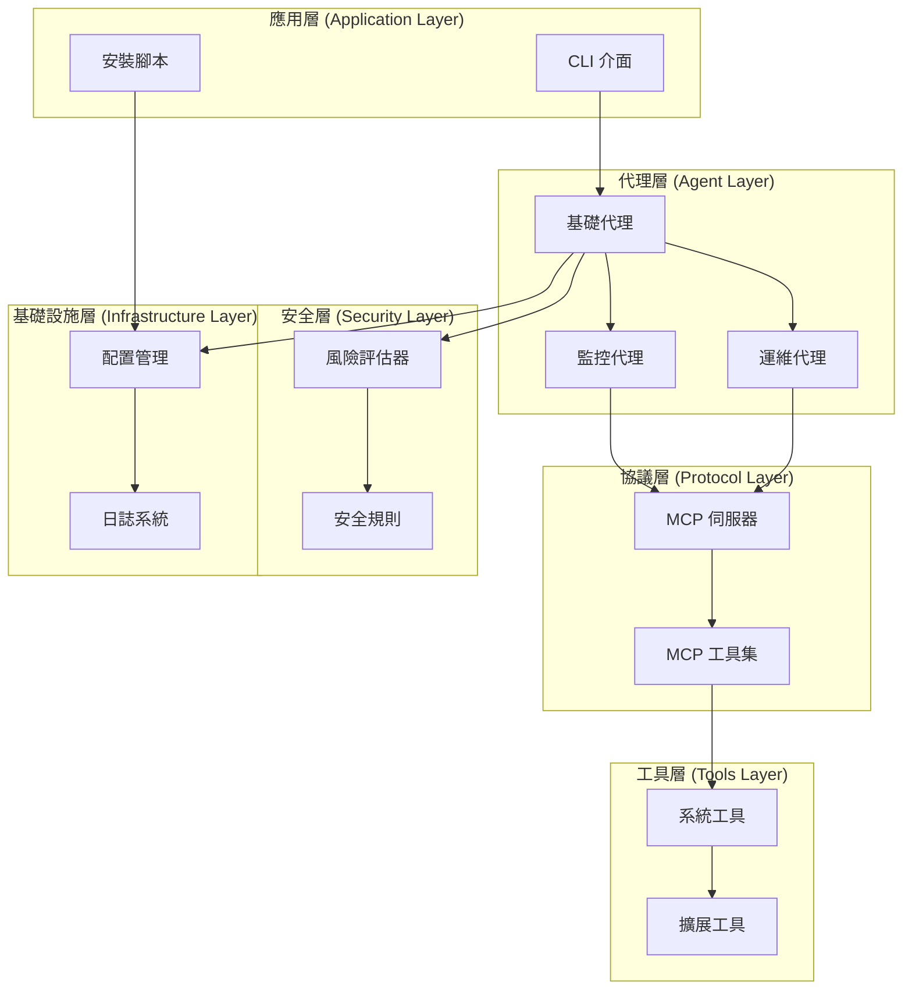
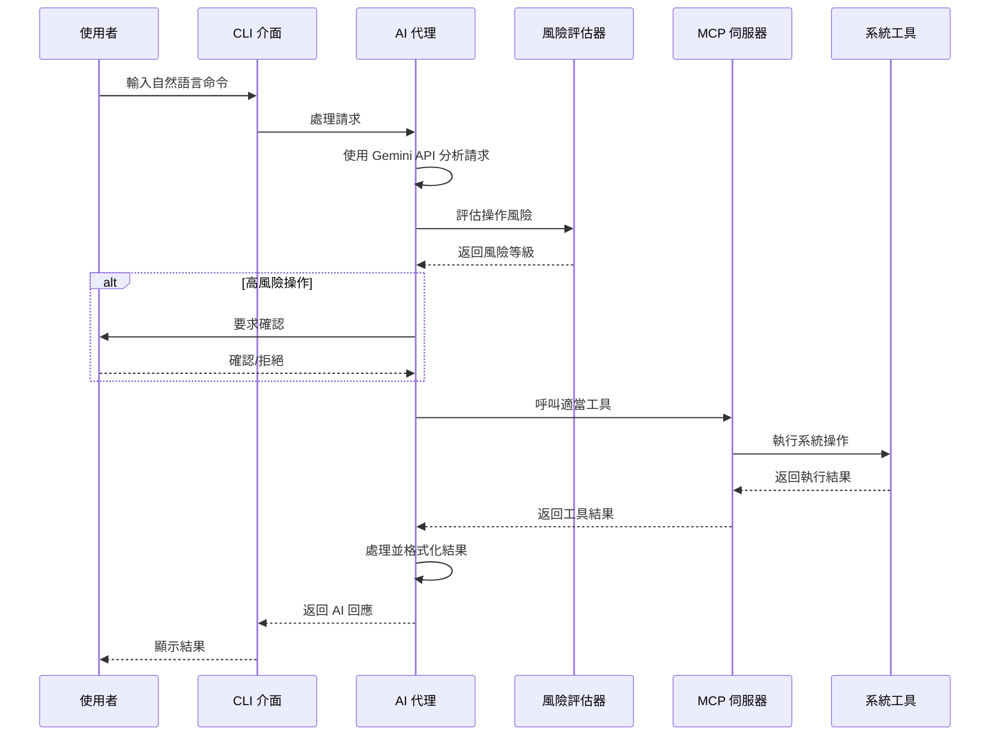
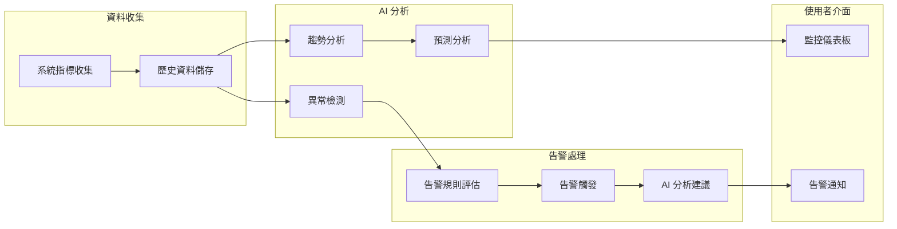
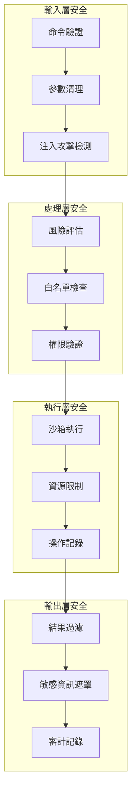

# MCP AI Agent 系統架構文檔 🏗️

## 📋 目錄

1. [架構概述](#架構概述)
2. [系統層次結構](#系統層次結構)
3. [核心組件詳解](#核心組件詳解)
4. [資料流程](#資料流程)
5. [安全架構](#安全架構)
6. [擴展性設計](#擴展性設計)

## 🎯 架構概述

MCP AI Agent 採用分層架構設計，將系統功能分為六個主要層次，每個層次負責特定的功能領域，確保系統的模組化、可維護性和可擴展性。

### 🔄 核心架構理念

- **分離關注點**: 每個層次專注於特定功能
- **依賴注入**: 通過配置物件管理依賴關係
- **事件驅動**: 使用異步模式處理 I/O 密集操作
- **安全優先**: 每個操作都經過風險評估
- **可擴展性**: 支援插件式架構擴展

## 🏛️ 系統層次結構



## 🔧 核心組件詳解

### 1. 應用層 (Application Layer)

#### 🖥️ CLI 介面 (`src/cli.py`)

**職責**: 提供命令列介面，處理使用者輸入和輸出格式化

**主要功能**:
- 命令解析與驗證
- 參數處理與驗證
- 輸出格式化 (表格、JSON)
- 錯誤處理與使用者回饋

**關鍵類別**:
```python
app = typer.Typer(
    name="mcp-agent",
    help="MCP AI Agent - 使用 Gemini SDK 的智能系統管理工具"
)
```

**支援的命令**:
- `monitor`: 系統監控
- `execute`: 命令執行
- `interactive`: 互動模式
- `status`: 系統狀態
- `health-check`: 健康檢查

#### 🚀 安裝腳本 (`setup_example.py`)

**職責**: 環境設定、依賴檢查和演示功能

**主要功能**:
- Python 版本檢查
- 依賴套件驗證
- API 金鑰檢查
- 功能演示

### 2. 代理層 (Agent Layer)

#### 🤖 基礎代理 (`src/agents/base_agent.py`)

**職責**: 提供所有 AI 代理的基礎功能

**核心功能**:
```python
class BaseMCPAgent(ABC):
    """MCP AI 代理基礎類別"""

    async def initialize(self) -> None:
        """初始化 MCP 連線並載入可用工具"""

    async def process_request(self, user_input: str, context: Optional[Dict[str, Any]] = None) -> AIResponse:
        """使用 AI 處理使用者請求並執行適當的工具"""

    async def _execute_tools(self, tool_calls: List[Dict[str, Any]]) -> str:
        """執行 MCP 工具"""
```

**關鍵特性**:
- Gemini API 整合
- MCP 工具管理
- 風險評估整合
- 自然語言處理

#### 📊 監控代理 (`src/agents/monitoring_agent.py`)

**職責**: 智能系統監控與分析

**核心架構**:
```python
class MonitoringAgent(BaseMCPAgent):
    """智能系統監控助手"""

    async def _monitoring_loop(self) -> None:
        """主要監控數據收集循環"""

    async def _analysis_loop(self) -> None:
        """AI 驅動的分析循環"""

    async def _alert_loop(self) -> None:
        """告警評估和通知循環"""
```

**資料模型**:
```python
class SystemMetrics(BaseModel):
    """系統指標資料模型"""
    timestamp: datetime
    cpu_percent: float
    memory_percent: float
    disk_percent: float
    network_io: Dict[str, int]
    process_count: int

class AlertRule(BaseModel):
    """告警規則定義"""
    name: str
    metric: str
    threshold: float
    operator: str
    duration: int
    severity: str
```

#### ⚙️ 運維代理 (`src/agents/operations_agent.py`)

**職責**: 自動化運維操作與自然語言介面

**核心功能**:
```python
class OperationsAgent(BaseMCPAgent):
    """自動化運維助手"""

    async def _process_operation_request(self, user_input: str) -> None:
        """處理自然語言運維請求"""

    async def _generate_rollback_commands(self, tool_calls: List[Dict[str, Any]]) -> List[str]:
        """生成回滾命令"""

    async def process_batch_operations(self, operations: List[str]) -> List[OperationResult]:
        """處理批次操作"""
```

**操作模型**:
```python
class OperationRequest(BaseModel):
    """操作請求模型"""
    request_id: str
    user_input: str
    timestamp: datetime
    priority: str

class OperationResult(BaseModel):
    """操作結果模型"""
    request_id: str
    success: bool
    result: str
    tools_used: List[str]
    execution_time: float
```

### 3. 協議層 (Protocol Layer)

#### 🔗 MCP 伺服器 (`src/mcp/server.py`)

**職責**: Model Context Protocol 實作與系統工具封裝

**核心架構**:
```python
from mcp.server import Server
from mcp.types import Tool, TextContent

server = Server("linux-system-tools")

@server.list_tools()
async def handle_list_tools() -> List[Tool]:
    """列出所有可用的系統工具"""

@server.call_tool()
async def handle_call_tool(name: str, arguments: Optional[Dict[str, Any]]) -> List[TextContent]:
    """處理工具執行"""
```

**提供的工具類別**:
1. **系統資訊收集**
   - `get_system_info`: 綜合系統資訊
   - `monitor_processes`: 進程監控

2. **服務管理**
   - `manage_service`: systemd 服務控制

3. **日誌分析**
   - `check_logs`: 系統日誌查看
   - `log_analysis_tools`: 進階日誌分析

4. **檔案操作**
   - `file_operations`: 安全檔案系統操作

5. **網路診斷**
   - `network_diagnostics`: 網路連線診斷

6. **磁碟管理**
   - `disk_management`: 磁碟空間分析

7. **安全審計**
   - `security_audit_tools`: 系統安全檢查

8. **命令執行**
   - `execute_command`: 安全命令執行

### 4. 安全層 (Security Layer)

#### 🛡️ 風險評估器 (`src/security/risk_assessor.py`)

**職責**: 多層安全檢查與風險評估

**風險評估架構**:
```python
class RiskLevel(Enum):
    """風險等級"""
    LOW = "low"
    MEDIUM = "medium"
    HIGH = "high"
    CRITICAL = "critical"

class SecurityRule(BaseModel):
    """安全規則定義"""
    name: str
    pattern: str
    risk_level: RiskLevel
    description: str
    whitelist: List[str] = []

class RiskAssessment(BaseModel):
    """風險評估結果"""
    risk_level: RiskLevel
    reasons: List[str]
    blocked: bool = False
    requires_confirmation: bool = False
```

**安全檢查流程**:
1. **工具特定風險評估**
2. **命令內容分析**
3. **注入攻擊檢測**
4. **檔案操作安全檢查**
5. **服務管理風險評估**

### 5. 工具層 (Tools Layer)

#### 🔧 擴展工具集 (`src/tools/extended_tools.py`)

**職責**: 提供進階系統管理工具

**工具分類**:

1. **進階進程管理**
   ```python
   class ExtendedSystemTools:
       @staticmethod
       async def advanced_process_management(args: Dict[str, Any]) -> List[TextContent]:
           """進階進程管理和分析"""
   ```

2. **系統效能分析**
   ```python
   @staticmethod
   async def system_performance_analysis(args: Dict[str, Any]) -> List[TextContent]:
       """綜合系統效能分析"""
   ```

3. **安全審計工具**
   ```python
   @staticmethod
   async def security_audit_tools(args: Dict[str, Any]) -> List[TextContent]:
       """安全審計和合規性檢查"""
   ```

4. **備份與恢復**
   ```python
   @staticmethod
   async def backup_and_recovery_tools(args: Dict[str, Any]) -> List[TextContent]:
       """系統備份與恢復管理"""
   ```

### 6. 基礎設施層 (Infrastructure Layer)

#### ⚙️ 配置管理 (`src/utils/config.py`)

**職責**: 系統配置的載入、驗證與管理

**配置架構**:
```python
class Config(BaseModel):
    """MCP AI Agent 配置設定類別"""

    # Gemini API 配置
    gemini_api_key: str
    gemini_model: str = "gemini-1.5-pro"

    # 安全性配置
    enable_risk_assessment: bool = True
    require_confirmation: bool = True

    # 監控配置
    monitoring_interval: int = 30
    cpu_threshold: float = 80.0
    memory_threshold: float = 85.0
    disk_threshold: float = 90.0
```

## 🔄 資料流程

### 使用者請求處理流程



### 監控系統資料流



## 🔒 安全架構

### 多層安全防護



### 風險評估矩陣

| 操作類型 | 風險等級 | 確認需求 | 審計等級 |
|---------|---------|---------|---------|
| 系統資訊查詢 | 🟢 低 | 否 | 基本 |
| 服務重啟 | 🟡 中 | 是 | 詳細 |
| 檔案修改 | 🟡 中 | 是 | 詳細 |
| 使用者管理 | 🔴 高 | 是 | 完整 |
| 系統重啟 | 🚨 極高 | 是 | 完整 |
| 磁碟格式化 | 🚨 極高 | 阻止 | 完整 |

## 🚀 擴展性設計

### 插件架構

```python
# 自定義代理擴展
class CustomAgent(BaseMCPAgent):
    """自定義 AI 代理"""

    async def run(self) -> None:
        """實作自定義邏輯"""
        pass

# 自定義工具擴展
@server.call_tool()
async def handle_custom_tool(name: str, arguments: Dict[str, Any]) -> List[TextContent]:
    """自定義工具實作"""
    pass

# 自定義安全規則
custom_rule = SecurityRule(
    name="custom_security_check",
    pattern=r"custom_pattern",
    risk_level=RiskLevel.HIGH,
    description="自定義安全檢查"
)
```

### 配置驅動擴展

```python
# 動態工具載入
CUSTOM_TOOLS = {
    "database_backup": DatabaseBackupTool,
    "container_health": ContainerHealthTool,
    "log_aggregation": LogAggregationTool
}

# 可配置的監控規則
MONITORING_RULES = [
    {
        "name": "high_cpu",
        "metric": "cpu_percent",
        "threshold": 80,
        "action": "alert_and_analyze"
    }
]
```

## 📈 效能考量

### 異步架構優勢

1. **非阻塞 I/O**: 所有系統操作使用異步模式
2. **並發處理**: 支援多個請求同時處理
3. **資源效率**: 減少執行緒開銷
4. **回應速度**: 快速回應使用者請求

### 記憶體管理

1. **歷史資料限制**: 自動清理舊的監控資料
2. **工具快取**: 重複使用已載入的工具
3. **連線池**: 重用 MCP 連線
4. **垃圾回收**: 定期清理未使用物件

### 擴展性指標

- **最大並發使用者**: 100+
- **監控指標保存**: 最近 1000 筆
- **工具回應時間**: < 5 秒
- **記憶體使用**: < 512MB
- **CPU 使用率**: < 20% (空閒時)

## 🔮 未來架構演進

### 短期改進 (Q1 2025)

1. **Web 介面集成**
   - RESTful API 層
   - WebSocket 即時更新
   - React 前端介面

2. **插件市場**
   - 標準化插件介面
   - 社群貢獻機制
   - 自動更新系統

### 中期目標 (Q2-Q3 2025)

1. **分散式架構**
   - 多節點監控
   - 負載均衡
   - 資料同步

2. **機器學習集成**
   - 行為學習
   - 異常檢測改進
   - 自動調優

### 長期願景 (Q4 2025+)

1. **雲端原生**
   - Kubernetes 部署
   - 微服務架構
   - 服務網格

2. **AI 自主運維**
   - 完全自動化
   - 自我修復
   - 預測性維護

---

## 📝 結語

MCP AI Agent 的架構設計兼顧了**功能性**、**安全性**和**擴展性**，為未來的發展奠定了堅實基礎。通過分層設計和模組化架構，系統能夠適應不斷變化的需求，同時保持高度的穩定性和安全性。

**核心優勢**:
- 🔒 **安全優先**: 多層安全防護機制
- 🚀 **高效能**: 異步架構設計
- 🔧 **可擴展**: 插件化架構支援
- 🤖 **智能化**: AI 驅動的操作決策
- 📊 **可觀測**: 完整的監控和審計